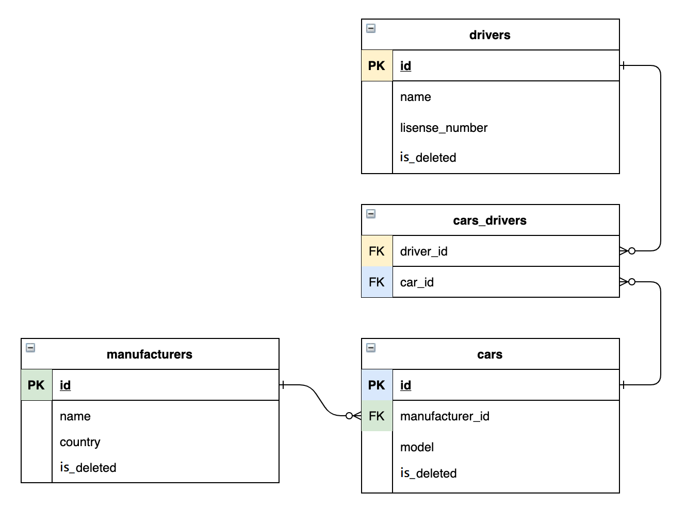

# Taxi Service

## Overview
It's a simple taxi service web application, which simulates the work of a taxi service and supports authentication and interaction with the database, designed to showcase my experience working with various Java web development technologies

---
## Use cases
After registration, feel free to test full app functionality. Such as:
- Delete car, taxi driver, or car manufacturer from the database
- See all taxi drivers, cars and car manufacturers
- Add to car record info about its driver(s)
- Remove driver from cars drivers list
---
## Implementation details

### 3-layer architecture:

- Data access layer: DAO
- Business logic layer: Services
- Presentation layer: Controllers

### Used technologies:
- Maven Checkstyle Plugin
- JDBC
- HttpServlet and HttpFilter
- HTML, CSS, JSP, JSTL
- Apache Tomcat (v9.0.50)
- MySQL
- Maven

### This diagram illustrates relations between entities in DB

---
## How to run this application

### Tools needed:

- IntelliJ IDEA Ultimate IDEA
- MySQL and MySQL Workbench MySQL
- Apache Tomcat(or another servlet container) for your IDE

1. Fork this project to your repository
2. Clone the project on your IDE
3. Create a database by using the SQL queries from the init_db.sql file
4. Change username, password and URL values in the /util/ConnectionUtil.java to open a connection with your database
5. Add Tomcat configuration to your project.
6. Run this project using Tomcat's local server
---
